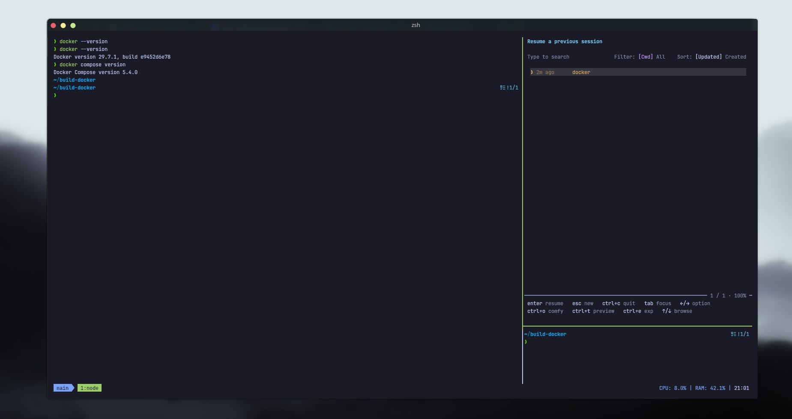
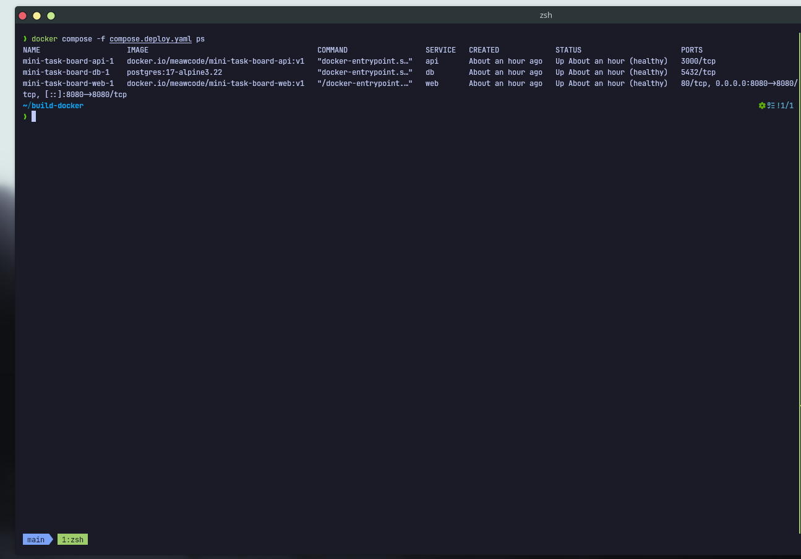
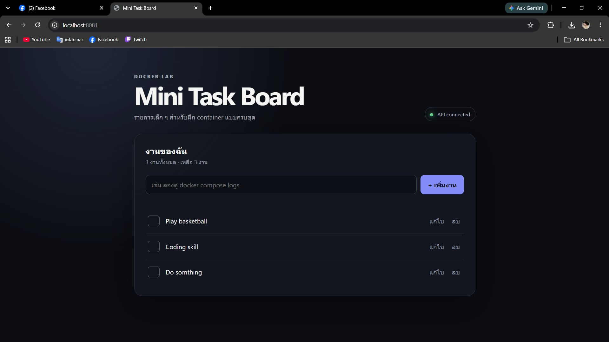
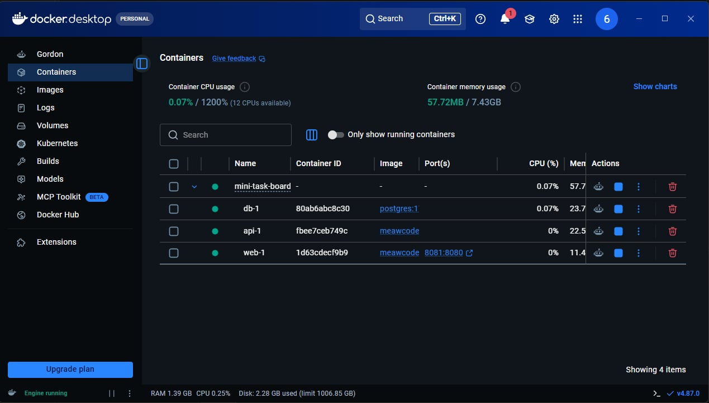

# Mini Task Board — Docker Learning Project

เว็บจำลอง CRUD ขนาดเล็กสำหรับเรียนรู้ Docker แบบลงมือทำ ตั้งแต่การสร้าง image, เชื่อมต่อหลาย containers และจัดเก็บข้อมูล ไปจนถึงนำระบบไปรันบนเครื่องอื่น

ทดลองใช้งานออนไลน์: [Mini Task Board บน Cloudflare](https://mini-task-board.664110310060.workers.dev)

```text
Browser :8080
      │
      ▼
 Nginx (web) ── /api ──▶ Express (api) ──▶ PostgreSQL (db)
      │                       │                    │
 frontend network ────────────┘       backend network (internal)
                                               │
                                      postgres_data volume
```

มีเพียง Nginx ที่เปิดพอร์ตออกจาก Docker ส่วน API และฐานข้อมูลสื่อสารกันด้วย service name บน Compose networks

## สิ่งที่ได้เรียนรู้

- Dockerfile, build context, layer cache และ `.dockerignore`
- production dependencies และการรัน Node.js ด้วย non-root user
- Docker Compose, service discovery และ reverse proxy
- healthcheck และการรอ dependency ให้พร้อม
- environment variables, named volume และ internal network
- logs, exec, inspect, restart และการล้าง resource
- tag, push, pull และ deploy ผ่าน Docker Hub

## โครงสร้าง

```text
.
├── api/                    # Express API, PostgreSQL store และ tests
├── cloudflare/             # Worker API, D1 migration และ deployment config
├── docs/images/            # ภาพหลักฐานการทำงาน
├── web/                    # Static UI และ Nginx reverse proxy
├── compose.yaml            # Local build จาก source
├── compose.deploy.yaml     # Pull immutable images จาก Docker Hub
└── .env.example            # ตัวแปรตัวอย่าง (ไม่เก็บ .env ใน Git)
```

## หลักฐานการทำงาน

### ภาพที่ 1 — การติดตั้ง Docker

ตรวจสอบการติดตั้ง Docker 29.7.1 และ Docker Compose 5.4.0 บนเครื่อง Linux



### ภาพที่ 2 — รันหลาย containers พร้อมกัน

ระบบรัน Web, API และ PostgreSQL พร้อมกัน 3 containers โดยทุก service อยู่ในสถานะ `healthy`



### ภาพที่ 3 — นำเว็บไซต์ไปรันบนเครื่องอื่น

เพื่อนดึง images จาก Docker Hub ไปรันบน Windows ผ่าน port `8081` โดยหน้า Mini Task Board เชื่อมต่อ API และ PostgreSQL สำเร็จ



Docker Desktop แสดง Web, API และ PostgreSQL ทำงานพร้อมกันบนเครื่องปลายทาง



## 1. รันบนเครื่องพัฒนา

ต้องมี Docker Engine และคำสั่ง `docker compose`

```bash
cp .env.example .env
docker compose up --build -d
docker compose ps
```

เปิด <http://localhost:8080> แล้วลองเพิ่ม แก้ไข ทำเครื่องหมาย และลบงาน หากแก้ `WEB_PORT` ใน `.env` ให้ใช้พอร์ตนั้นแทน

ดูเส้นทาง request โดยแยก log ราย service:

```bash
docker compose logs -f web api db
```

กด `Ctrl+C` เพื่อออกจากการตาม log โดย containers ยังทำงานต่อ

## 2. สำรวจ containers, networks และ volume

ดู process และ config ที่ Compose ประกอบขึ้นจริง:

```bash
docker compose top
docker compose config
docker compose exec api node --version
docker compose exec db psql -U taskboard -d taskboard -c 'SELECT * FROM tasks;'
```

ดู resources ที่ Compose สร้าง:

```bash
docker network inspect mini-task-board_frontend
docker network inspect mini-task-board_backend
docker volume inspect mini-task-board_postgres_data
```

`backend` เป็น internal network และ service `db` ไม่มี `ports:` จึงไม่สามารถต่อ PostgreSQL ตรงจาก host ได้

## 3. พิสูจน์ว่า volume เก็บข้อมูล

สร้างงานผ่านหน้าเว็บก่อน แล้วทดลอง restart และ recreate:

```bash
docker compose restart
docker compose down
docker compose up -d
```

งานเดิมควรยังอยู่ เพราะ `docker compose down` ปกติไม่ลบ named volume

> คำสั่งต่อไปนี้ลบข้อมูล PostgreSQL ของ lab อย่างถาวร ใช้เมื่อต้องการเริ่มใหม่เท่านั้น

```bash
docker compose down --volumes
```

## 4. รัน automated tests

Tests ใช้ in-memory store จึงไม่ต้องเปิด PostgreSQL:

```bash
cd api
npm ci
npm test
cd ..
```

ตรวจ health ผ่านเส้นทางที่ผู้ใช้เข้าจริง:

```bash
curl --fail http://localhost:8080/healthz
curl --fail http://localhost:8080/api/tasks
```

## 5. Build และ push ไป Docker Hub

สร้าง public repositories ชื่อ `mini-task-board-web` และ `mini-task-board-api` ใน Docker Hub ก่อน จากนั้นแทน `YOUR_NAME` ด้วย username จริง:

```bash
export DOCKERHUB_USERNAME=YOUR_NAME
export IMAGE_TAG=v1

docker login
docker build -t "$DOCKERHUB_USERNAME/mini-task-board-web:$IMAGE_TAG" ./web
docker build -t "$DOCKERHUB_USERNAME/mini-task-board-api:$IMAGE_TAG" ./api
docker push "$DOCKERHUB_USERNAME/mini-task-board-web:$IMAGE_TAG"
docker push "$DOCKERHUB_USERNAME/mini-task-board-api:$IMAGE_TAG"
```

ใช้ tag แบบระบุรุ่น เช่น `v1` เพื่อให้เครื่องปลายทางได้ image ชุดเดิมเสมอ ไม่ผูก deployment กับ `latest`

ตรวจว่าสอง images มี architecture เป็น `amd64` ก่อนนำไป Linux x86_64:

```bash
docker image inspect "$DOCKERHUB_USERNAME/mini-task-board-web:$IMAGE_TAG" --format '{{.Architecture}}'
docker image inspect "$DOCKERHUB_USERNAME/mini-task-board-api:$IMAGE_TAG" --format '{{.Architecture}}'
```

## 6. Deploy บน Linux x86_64 เครื่องอื่น

เครื่องปลายทางไม่ต้องมี source code, Node.js หรือ PostgreSQL ส่งไปเพียง `compose.deploy.yaml` และสร้าง `.env` เช่น:

```dotenv
DOCKERHUB_USERNAME=YOUR_NAME
IMAGE_TAG=v1
WEB_PORT=8080
POSTGRES_DB=taskboard
POSTGRES_USER=taskboard
POSTGRES_PASSWORD=replace-with-a-long-random-password
```

จาก directory ที่มีสองไฟล์นั้น:

```bash
docker compose --env-file .env -f compose.deploy.yaml pull
docker compose --env-file .env -f compose.deploy.yaml up -d
docker compose --env-file .env -f compose.deploy.yaml ps
curl --fail http://localhost:8080/api/tasks
```

จากเครื่องอื่นในเครือข่ายให้เปิด `http://IP-OF-SERVER:8080` และอนุญาต TCP port 8080 ใน firewall ของเครื่องปลายทางหากจำเป็น

อัปเดตเวอร์ชันด้วย tag ใหม่ แล้วแก้ `IMAGE_TAG` ใน `.env`:

```bash
docker compose --env-file .env -f compose.deploy.yaml pull
docker compose --env-file .env -f compose.deploy.yaml up -d
```

Compose จะ recreate เฉพาะ service ที่ image เปลี่ยน และไม่ลบ database volume

## 7. Deploy เป็นเว็บสาธารณะบน Cloudflare

เวอร์ชันออนไลน์ใช้หน้าเว็บชุดเดียวกัน แต่เปลี่ยน backend จาก Express + PostgreSQL ใน Docker เป็น Cloudflare Worker + D1 เพื่อให้แชร์ลิงก์ให้ผู้อื่นทดลองได้โดยไม่ต้องเปิดเครื่องเราไว้

Production URL: <https://mini-task-board.664110310060.workers.dev>

ติดตั้ง dependencies และเข้าสู่ระบบ Cloudflare:

```bash
cd cloudflare
npm ci
npx wrangler login
```

เมื่อต้อง deploy ในบัญชี Cloudflare ใหม่ ให้สร้าง D1 และนำ `database_id` ที่ได้ไปใส่ใน `wrangler.jsonc`:

```bash
npx wrangler d1 create mini-task-board --location=apac
npm run db:migrate:remote
npm run deploy
```

หลังจากตั้งค่า database แล้ว การอัปเดตครั้งต่อไปใช้เพียง:

```bash
cd cloudflare
npm ci
npm test
npm run deploy
```

ไฟล์ใน `cloudflare/public/` ถูกสร้างจาก `web/` ตอน build และไม่ถูกเก็บใน Git ส่วนข้อมูลของ D1 แยกจาก PostgreSQL volume ของเวอร์ชัน Docker

## API reference

| Method | Path | Body | ผลลัพธ์ |
| --- | --- | --- | --- |
| `GET` | `/health` | — | สถานะ API และ database |
| `GET` | `/api/tasks` | — | รายการงานทั้งหมด |
| `POST` | `/api/tasks` | `{"title":"Build image"}` | สร้างงาน |
| `PATCH` | `/api/tasks/:id` | `{"title":"Push image","completed":true}` | แก้ชื่องาน/สถานะ |
| `DELETE` | `/api/tasks/:id` | — | ลบงาน |

`title` ต้องมี 1–200 ตัวอักษร และ `completed` ต้องเป็น boolean

## Troubleshooting

ดูว่า service ใดไม่ healthy และอ่าน log ล่าสุด:

```bash
docker compose ps
docker compose logs --tail=100 api db web
```

ตรวจ DNS/service discovery จาก API ไปฐานข้อมูล:

```bash
docker compose exec api getent hosts db
```

หากพอร์ต 8080 ถูกใช้อยู่ ให้เปลี่ยน `WEB_PORT` ใน `.env` เช่น `WEB_PORT=8081` แล้วรัน `docker compose up -d` ใหม่ หากเปลี่ยน database credentials หลัง volume ถูกสร้างแล้ว ค่าใน PostgreSQL เดิมจะไม่เปลี่ยนตาม environment; สำหรับ lab ที่ไม่ต้องเก็บข้อมูลให้ reset volume แล้วเริ่มใหม่
